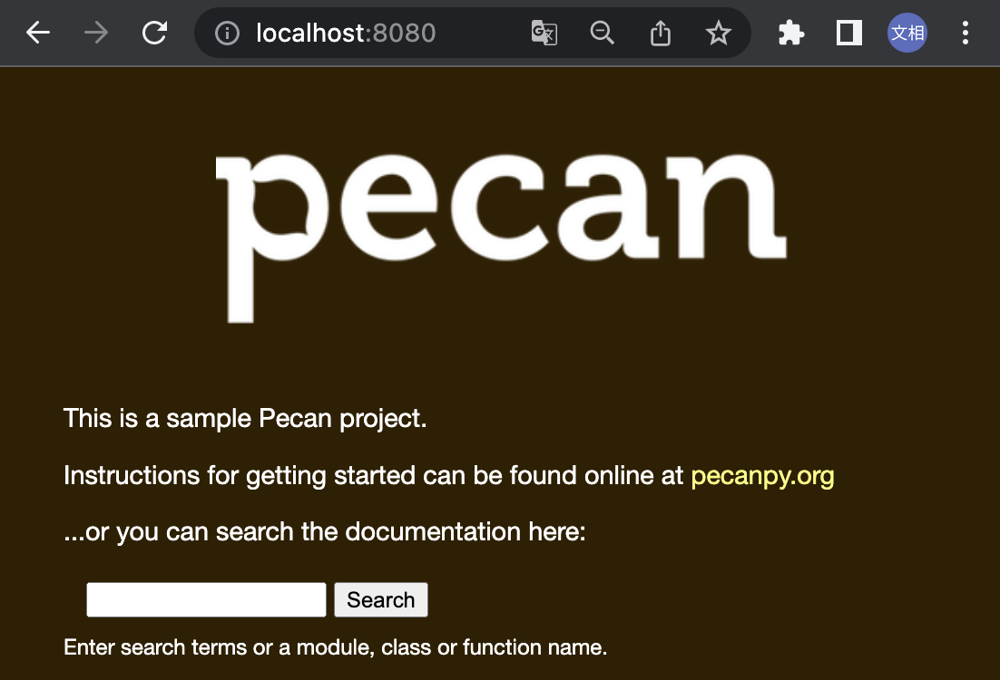
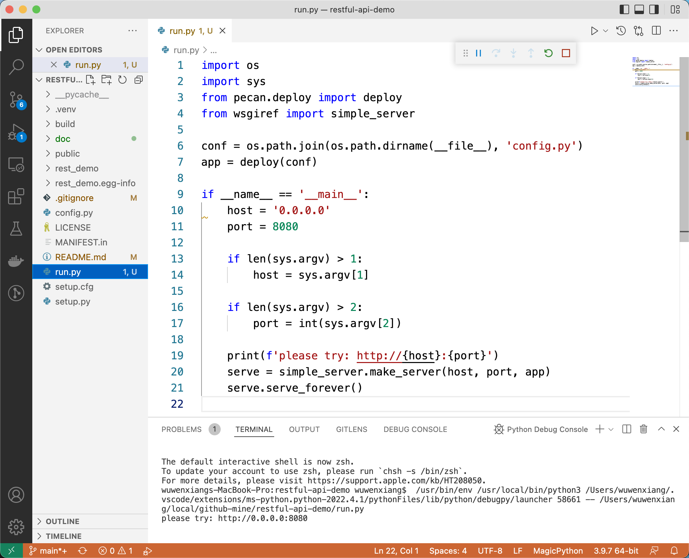

# How to Build a Restful API Web Service

该项目用于 Demo 如何搭建一个生产可用的 Restful API 服务

## 1. 开发注意事项

### 1.1 代码规范

项目测试接口：<https://governance.openstack.org/tc/reference/pti/python.html>

1. 单元测试：`stestr` & `pytest` / `unittest`
2. 代码风格检查：`tox -e pep8`
3. 覆盖率测试报告：`coverage` / `tox -e cover`
4. 源码包生成：`python setup.py sdist` / `python setup.py bdist_wheel`
5. 国际化：`babel`
6. 文档生成：`sphinx-build`
7. 自动格式化代码风格 `pylint`
8. API 接口文档：`API Doc` / `Swagger`

### 1.2 CI/CD

1. 容器镜像：`Dockerfile`
2. `.drone` 自动打包 / 部署
3. 数据初始化 `datainit.py`
4. 自动化接口测试 `gabbi`

### 1.3 开发流程

1. 先用户故事，前后端对齐
2. 数据库 + API，提交通过
3. 接口测试用例提交通过
4. 代码实现

### 1.4 ORM

1. SqlAlchemy：`Session Hook` / `Transaction` / `Relationship`
2. 支持 Sqlite3 做测试，MySQL 上生产
3. 数据库三范式，三表法
4. 级联删除

### 1.5 认证、鉴权和准入

1. 认证：本地认证和 OAUTH2
2. 鉴权：Casbin
3. 准入：API 计量，API Gateway，Kong

### 1.6 框架数据处理

1. API URL 定制化
2. 输入校验
3. 后端分页、排序、筛选框架

## 2. 框架搭建

### 2.1 参考文档

- pecan 官方文档 <https://pecan.readthedocs.io>
- pecan 源码：<https://github.com/PecanProject/pecan>

### 2.2 搭建步骤

#### 2.2.1 Quick Start

参考 <https://pecan.readthedocs.io/en/latest/installation.html#stable-version>

```bash
python -m virtualenv .venv
source .venv/bin/activate

pip install pecan==1.4.1 # 2021.04.20 stable 版本
```

参考 <https://pecan.readthedocs.io/en/latest/quick_start.html>

```bash
pecan create rest_demo
cd rest_demo
python setup.py develop
```

得到如下文件结构

```console
$ find rest_demo | grep -v -E '\.pyc$' | grep -v '\.egg-info'
rest_demo
rest_demo/rest_demo
rest_demo/rest_demo/tests
rest_demo/rest_demo/tests/config.py
rest_demo/rest_demo/tests/test_functional.py
rest_demo/rest_demo/tests/__init__.py
rest_demo/rest_demo/tests/__pycache__
rest_demo/rest_demo/tests/test_units.py
rest_demo/rest_demo/__init__.py
rest_demo/rest_demo/__pycache__
rest_demo/rest_demo/model
rest_demo/rest_demo/model/__init__.py
rest_demo/rest_demo/model/__pycache__
rest_demo/rest_demo/app.py
rest_demo/rest_demo/templates
rest_demo/rest_demo/templates/index.html
rest_demo/rest_demo/templates/layout.html
rest_demo/rest_demo/templates/error.html
rest_demo/rest_demo/controllers
rest_demo/rest_demo/controllers/__init__.py
rest_demo/rest_demo/controllers/__pycache__
rest_demo/rest_demo/controllers/root.py
rest_demo/config.py
rest_demo/MANIFEST.in
rest_demo/setup.py
rest_demo/public
rest_demo/public/css
rest_demo/public/css/style.css
rest_demo/public/images
rest_demo/public/images/logo.png
rest_demo/setup.cfg
```

编辑 `.gitignore` 文件，忽略 `pyc` 和 `egg-info` 文件，然后将生成的代码进版本控制（去掉最外层目录，使 `setup.cfg` 位于项目的最外层目录下）

```diff
diff --git a/.gitignore b/.gitignore
index dfcfd56..e2afd61 100644
--- a/.gitignore
+++ b/.gitignore
@@ -17,6 +17,8 @@
 mono_crash.*
 
 # Build results
+*.egg-info/
+build/
 [Dd]ebug/
 [Dd]ebugPublic/
 [Rr]elease/
```

至此，我们就可以尝试把这个 pecan project 运行起来了，通过 `pip install .` 安装，通过 `pecan serve config.py` 在本地运行

```console
$ pip install .
...
Requirement already satisfied: pecan in ./.venv/lib/python3.9/site-packages (from rest-demo==0.1) (1.4.1)
...
Successfully built rest-demo
Installing collected packages: rest-demo
Successfully installed rest-demo-0.1

$ pecan serve config.py
Starting server in PID 51451
serving on 0.0.0.0:8080, view at http://127.0.0.1:8080
```



在这里搜索，会跳转到 pecan 官方文档。

#### 2.2.2 本地调试

前面的步骤，需要在先 pip 安装，然后通过 pecan 起本地的 http server，不便于本地调试，我们尝试增加一个 run.py，让本地调试变得容易。



#### 2.2.3 开发和测试框架

增加依赖组件版本控制文件：

- [requirements.txt](/requirements.txt)
- [test-requirements.txt](/test-requirements.txt)
- [lower-constraints.txt](/lower-constraints.txt)

增加 tox 配置文件 `tox.ini`，添加 `hacking` 目录，`.stestr.conf` 配置文件

至此，我们可以比较方便地进行测试：

```bash
# tox -e pep8
# tox -e py3
tox
```

#### 2.2.4 容器化部署

添加 `Dockerfile`、`.dockerignore`、`start.sh` 文件和 `deploy` 目录。

### 2.3 数据库

参考：<https://pecan.readthedocs.io/en/latest/databases.html>

增加 `production_config.py`，关闭生成环境中的 debug

`tests/config.py` 用 in memory 的 sqlite，参考：<https://docs.sqlalchemy.org/en/14/dialects/sqlite.html#connect-strings>
